# Compte-rendu de mission — Dev Legacy

---

## 0. Page de garde

- **Projet** : Loop — Back-end API (NestJS + TypeScript + TypeORM + PostgreSQL)
- **Auteur** : **Océane GLANEUX** — développeuse (3 chantiers : C1, C2, C3)
- **Lien du dépôt** : https://github.com/GLANEUX/loop_back
- **Lien de la PR** (accès lecture `@celianlb`) : https://github.com/GLANEUX/loop_back/pull/11
- **Date de la mission** : 2026-06-16

---

## 1. Reprise en main

- **État du projet au retour** : l'app compile et la majorité des tests passent, mais plusieurs frictions empêchaient un démarrage « propre » immédiat (voir ci-dessous).
- **Temps pour le faire tourner** : ~30 min (essentiellement le diagnostic des frictions ci-dessous : `dist/` en root, base Docker arrêtée, fixtures périmées).
- **Frictions rencontrées** :
  1. **Coquille dans `package.json`** : le script `seed` référençait `tsconfig-spaths`
     (au lieu de `tsconfig-paths`) → cassait `npm run seed`. _Corrigé._
  2. **`dist/` appartenant à `root:root`** (créé par un conteneur Docker en root) :
     `npm run build` échouait avec 213 erreurs `TS5033: EACCES permission denied`
     — **pas une erreur de code**, juste l'impossibilité d'écrire dans `dist/`.
     _Corrigé : suppression de `dist/` puis rebuild OK._
  3. **3 tests rouges au retour** (`profile.entity.spec.ts`, `discovery.service.spec.ts`) :
     les fixtures n'avaient pas suivi l'ajout des champs profil obligatoires
     (`phoneNumber`, `audio_presentation`). _Corrigé : filet remis à 111/111._
  4. **Base de données down + réseau Docker périmé** : `loop_db_dev` était arrêté depuis
     2 mois ; l'API tournait mais ne résolvait plus l'hôte `db` (`getaddrinfo EAI_AGAIN db`).
     Un `restart` ne suffisait pas (conteneur API attaché à un état réseau périmé).
     _Corrigé : `docker compose ... up -d --force-recreate` → API up sur le port 3001._

### Démarrage (procédure reproductible)

> Variables : rien à ajouter — l'app lit `.env.${NODE_ENV}` soit **`.env.development`**, déjà
> complet (`DATABASE_URL` → `db:5432`, `JWT_SECRET`, …). Le `.env` racine (URL Prisma) est un
> résidu **non utilisé** par ce projet NestJS/TypeORM.

```bash
docker compose -f docker/dev/docker-compose.yml up -d --force-recreate
docker compose -f docker/dev/docker-compose.yml exec api npm run migration:run:dev  # si pending
docker logs -f loop_api_dev   # attendre "🚀 API running on port 3001"
```

**📸 Le projet qui démarre :**

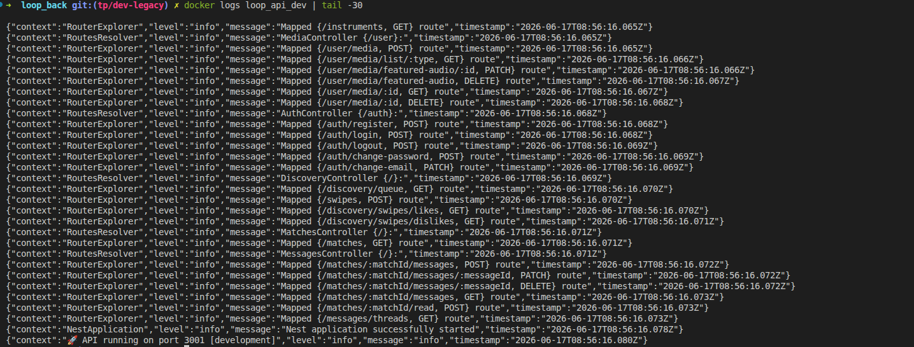

---

## 2. Tableau de bord — colonne « Avant »

| Indicateur                             | Avant                                                                                                        |
| -------------------------------------- | ------------------------------------------------------------------------------------------------------------ |
| Vulnérabilités (`npm audit`)           | **38** (1 critique, 17 high, 17 moderate, 3 low)                                                             |
| Dépendances obsolètes (`npm outdated`) | ~32 packages, 9 majeures disponibles                                                                         |
| Build / lint OK ?                      | Build ✅ OK (après correctif `dist/`) · Lint ✅ 0 erreur, 2 warnings prettier                                |
| Nb de tests / couverture               | **111 tests** (19 suites) — verts après correctif fixtures — couverture **72,8 %** lignes (53,97 % branches) |
| (Back) temps de réponse clé            | `GET /health` : **~5 ms** (médiane sur 5 appels, app dockerisée)                                             |

**📸 `npm audit` (avant) — 38 vulnérabilités :**

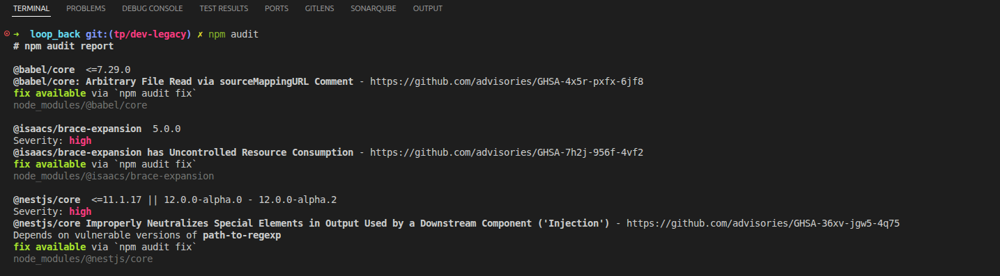
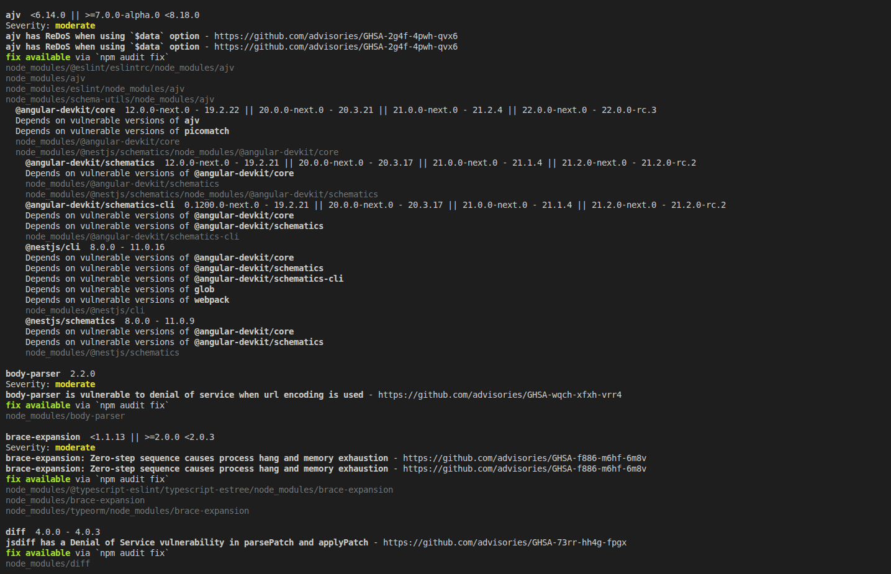
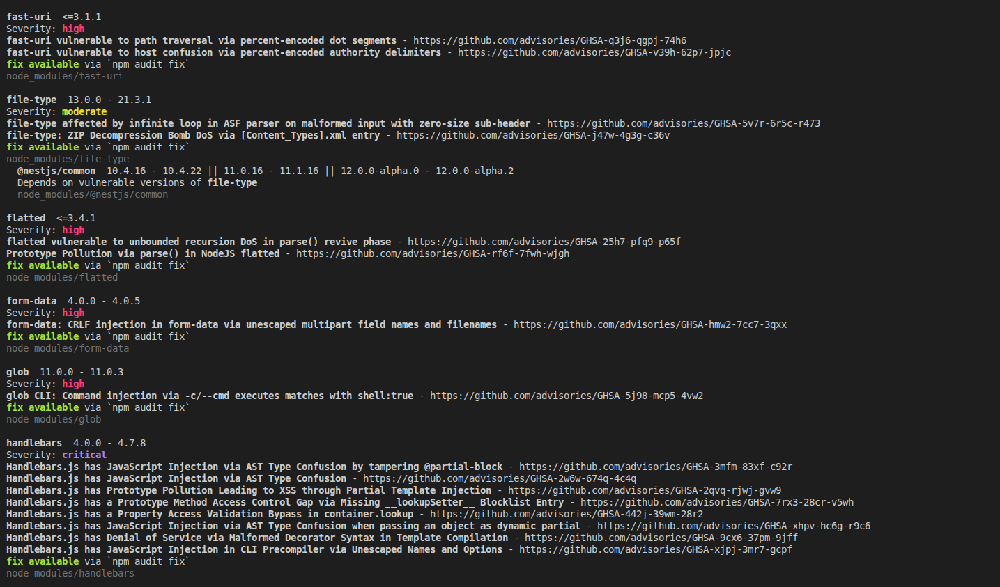
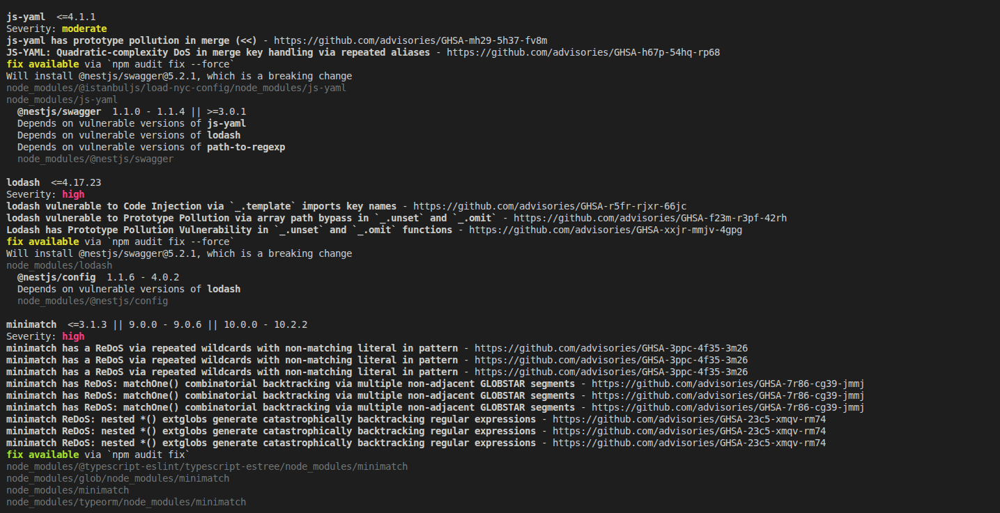
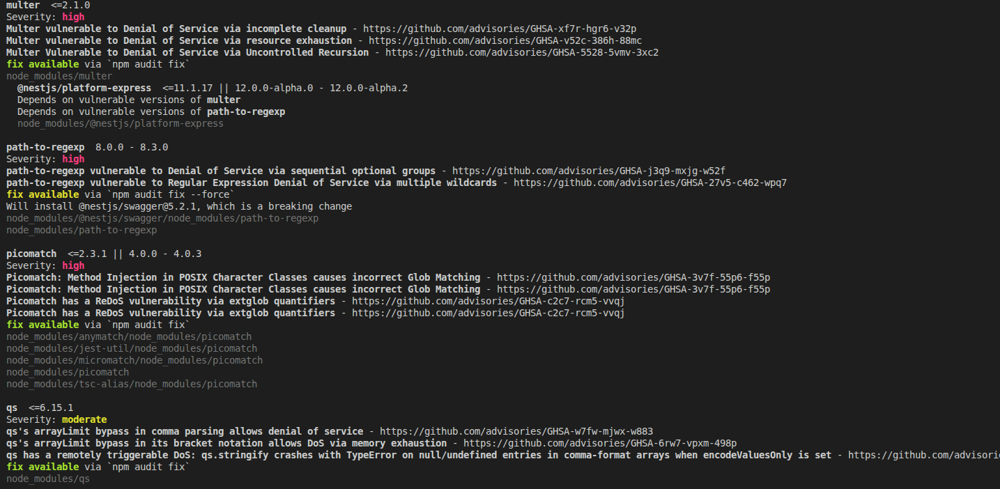
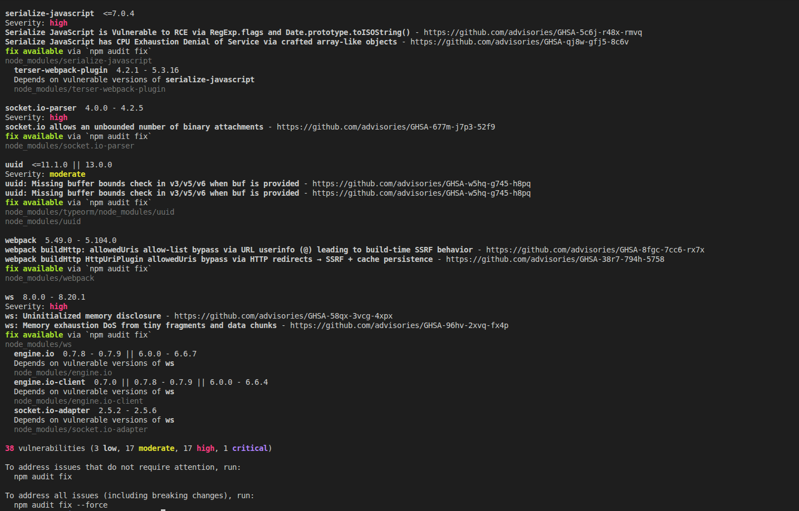

**📸 `npm outdated` (avant) — ampleur du retard :**

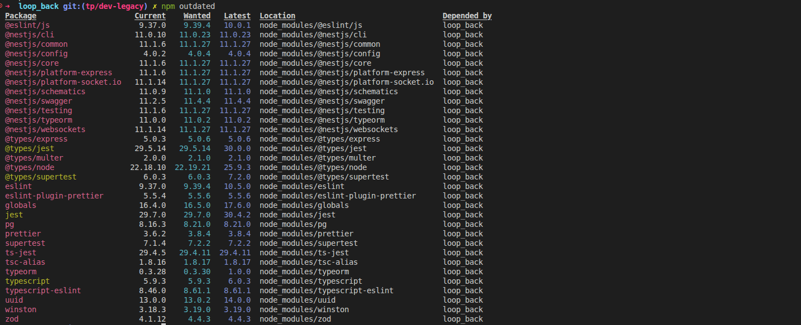

**📸 `npm test` (avant) — 111/111 verts :**

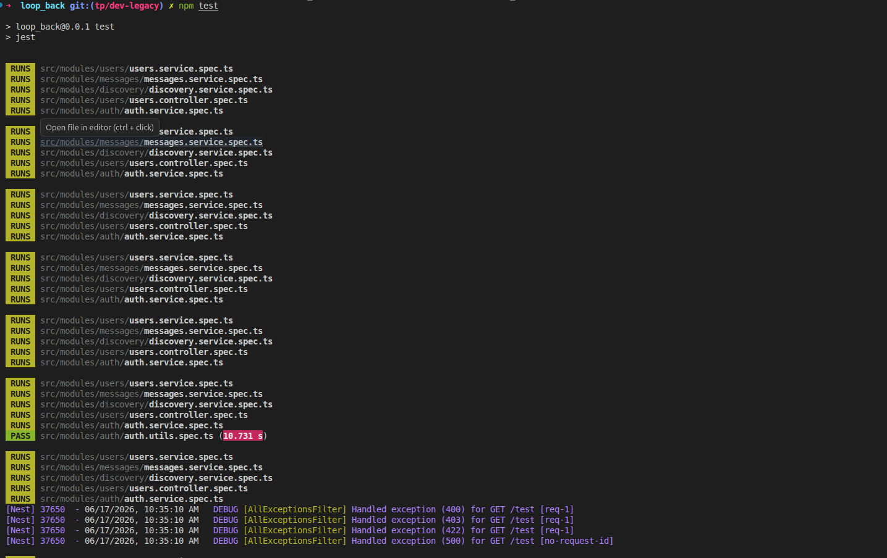
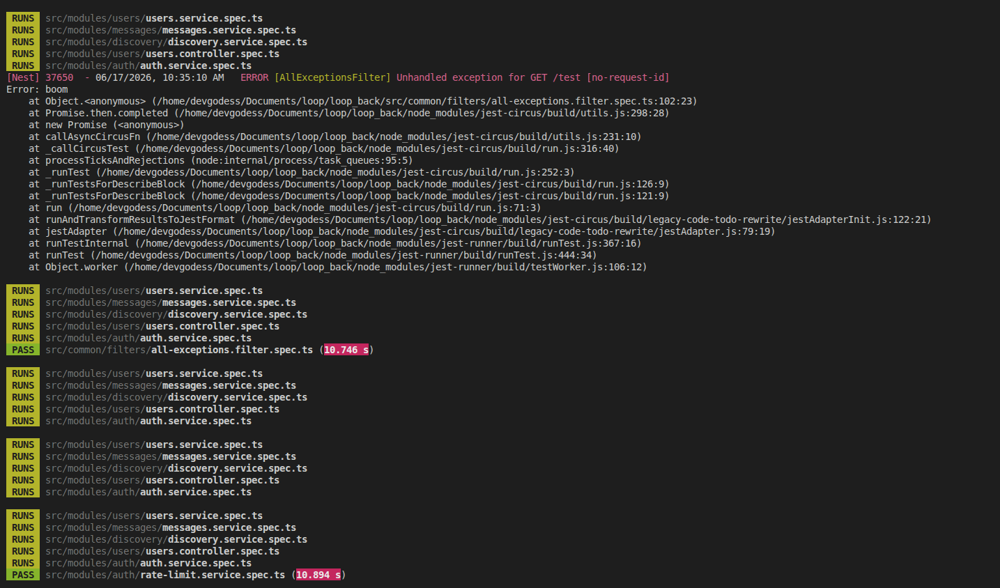
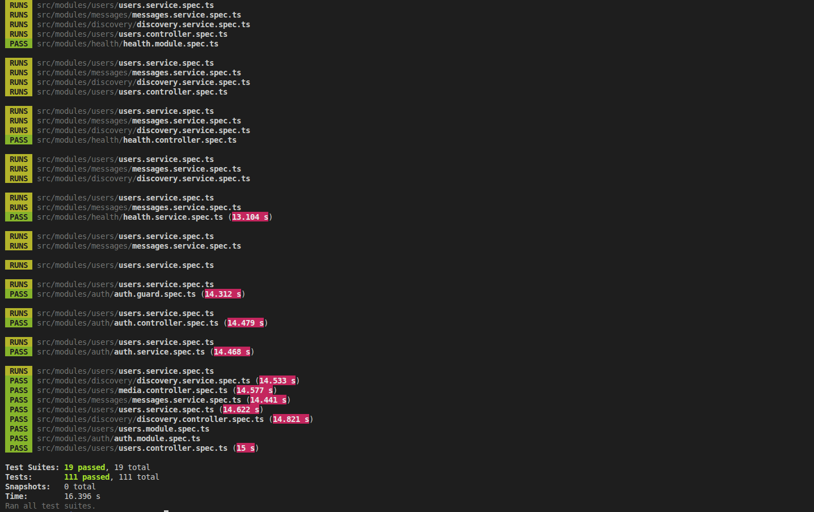

---

## 3. Fiche de cadrage

| Chantier             | Détail                                                                                                                                                                                                                           | « Fait » = quand…                                                                     |
| -------------------- | -------------------------------------------------------------------------------------------------------------------------------------------------------------------------------------------------------------------------------- | ------------------------------------------------------------------------------------- |
| **C1 — Mise à jour** | Faille : `@nestjs/core` 11.1.6 → 11.1.27 (high, injection path-to-regexp) **+** 2 majeures : `jest` 29 → 30 (+`@types/jest`, `ts-jest`) et `uuid` 13 → 14. **Rollback** : `git revert` + restore `package-lock.json` + `npm ci`. | Vulns réduites (38→20), majeures en place, suite verte, gain quantifié                |
| **C2 — Correctif**   | Bug : un profil **bloqué réapparaît dans les threads** car `swipe()` reformait un match sans vérifier le blocage — `src/modules/discovery/discovery.service.ts` (`swipe`/`ensureMatch`)                                          | Reproduit (test rouge), cause racine identifiée, corrigé, test de non-régression vert |
| **C3 — Évolutif**    | Feature : évolution « liste de mes bloqués » (`blocked_at` + tri par plus récent + recherche `?search=`) — `users.service.ts` (`listBlockedUsers`), `users.controller.ts`                                                        | Implémentée, testée, intégrée proprement                                              |

> Rappel énoncé : pas d'upgrade purement cosmétique, pas de réécriture complète.

---

## 4. C1 — Mise à jour & adaptation

### 4.1 Dépendances montées (avant → après)

**Volet sécurité** — `npm audit fix` (non-breaking, sans `--force`) : seul `package-lock.json`
a changé (les bornes `^` de `package.json` couvraient déjà les correctifs).

| Dépendance                                             | Avant        | Après    | Type                                                |
| ------------------------------------------------------ | ------------ | -------- | --------------------------------------------------- |
| `@nestjs/core`                                         | 11.1.6       | 11.1.27  | faille **high** corrigée (injection path-to-regexp) |
| `ws`, `body-parser`, `@babel/core`, `brace-expansion`… | (transitifs) | corrigés | failles critique/high/low                           |
| `jest`                                                 | 29.7.0       | 30.4.2   | **majeure** (breaking)                              |
| `@types/jest`                                          | 29.5         | 30.0     | aligné                                              |
| `ts-jest`                                              | 29.2         | 29.4.11  | compat Jest 30                                      |
| `uuid`                                                 | 13.0.0       | 14.0.0   | **majeure** (2ᵉ)                                    |

**Résultat sécurité mesuré** : **38 → 21 vulnérabilités** (1 critique + 17 high + 3 low **éliminés** ;
restent 21 modérées). Filet vert maintenu : 111/111.

### 4.2 Breaking changes Jest 30 — analyse d'exposition (guide officiel lu AVANT)

Source : <https://jestjs.io/docs/upgrading-to-jest30>. Chaque breaking change a été
confronté à notre code **avant** d'upgrader :

| Breaking change (Jest 30)                                            | Notre exposition                           | Action                       |
| -------------------------------------------------------------------- | ------------------------------------------ | ---------------------------- |
| Node ≥ 18 requis                                                     | Node **20.19** ✅                          | aucune                       |
| TypeScript ≥ 5.4 requis                                              | TS **5.9** ✅                              | aucune                       |
| `jest-environment-jsdom` → JSDOM v26                                 | `testEnvironment: "node"` → **N/A**        | aucune                       |
| Alias matchers supprimés (`toThrowError`, `toBeCalled`, `toReturn`…) | `grep` → **0 occurrence**                  | aucune                       |
| `jest.genMockFromModule` supprimé, deep-imports cassés               | **non utilisés**                           | aucune                       |
| Type `SpyInstance` déprécié                                          | 1 occurrence (`health.service.spec.ts:11`) | **modernisé → `jest.Spied`** |
| Inférence stricte de `toHaveBeenCalledWith`                          | tests verts, aucun faux positif            | aucune                       |

📎 **Extrait du guide cité** : _« Jest 30 drops support for Node 14, 16, 19, and 21. The minimum
supported Node versions are now 18.x. »_ et _« The minimum TypeScript version is now 5.4. »_

> **Conclusion** : montée majeure à faible friction **parce que** le projet maintient Node/TS à
> jour et utilise `testEnvironment: node`. Leçon reprise en §8 (rétro).

### 4.3 Code adapté

- `src/modules/health/health.service.spec.ts` : `let loggerErrorSpy: jest.SpyInstance` →
  `jest.Spied<typeof Logger.prototype.error>` (type recommandé par le guide Jest 30).
- `package.json` : `jest ^29.7→^30.4`, `@types/jest ^29→^30`, `ts-jest ^29.2→^29.4.11`.
- **uuid 13 → 14** (2ᵉ majeure) : aucune adaptation de code requise (`import { v4 }` inchangé,
  Node 20 / TS 5.9 déjà conformes). Vérifié par sanity runtime (génération v4 valide en CJS).
- **Preuves** : `tsc --noEmit` propre, 111/111 tests verts, build OK.

### 4.4 Plan de rollback

```bash
# Annuler les commits C1 (sécurité + Jest 30)
git revert e6143fb 0c7f55f
# ou retour direct à l'état figé du verrou de dépendances
cp package-lock.json.bak package-lock.json && npm ci
```

### 4.5 Preuves

**📸 Diff des dépendances montées (avant → après) :**

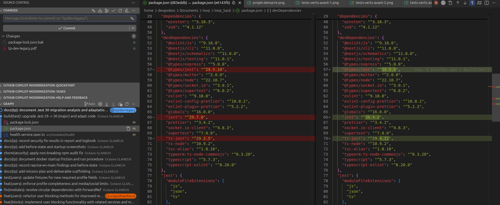

**📸 Extrait du guide de migration Jest 30 (breaking changes) :**

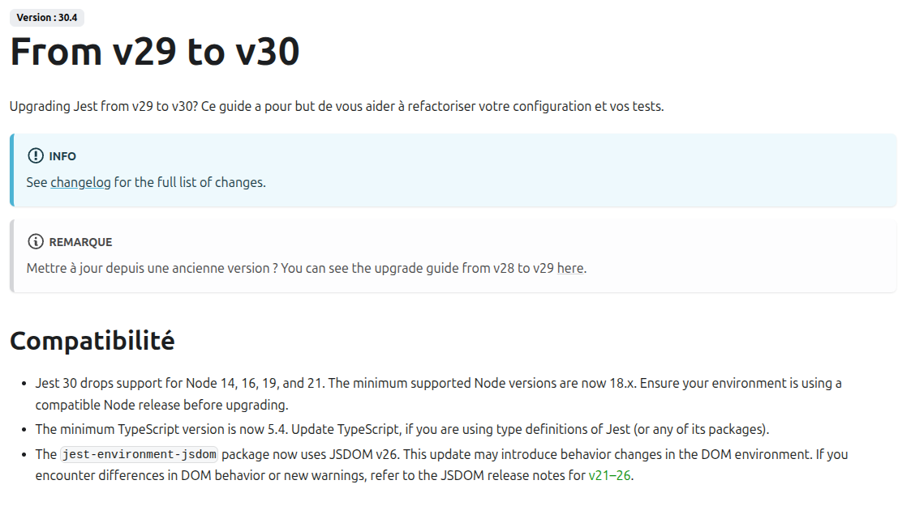

**📸 Tests au vert après upgrade :**

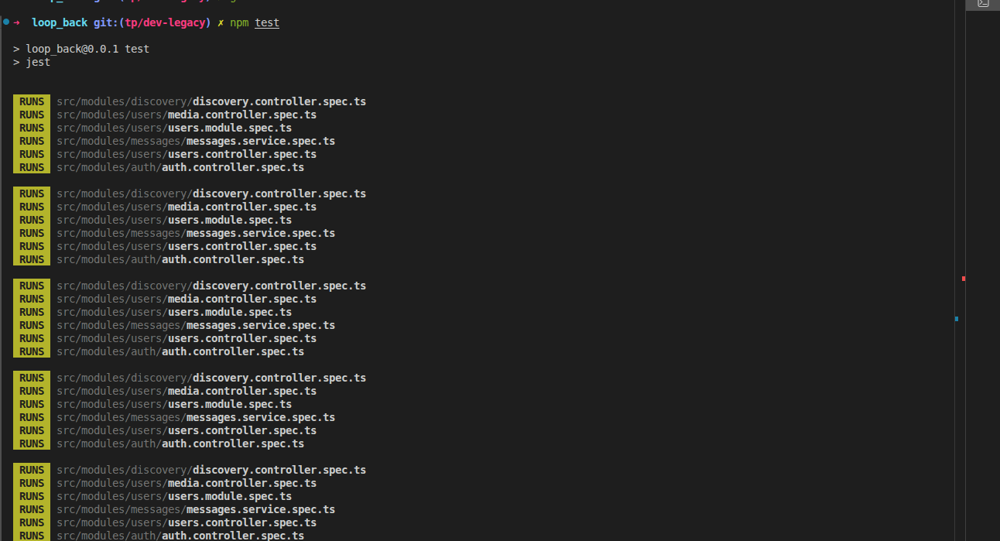
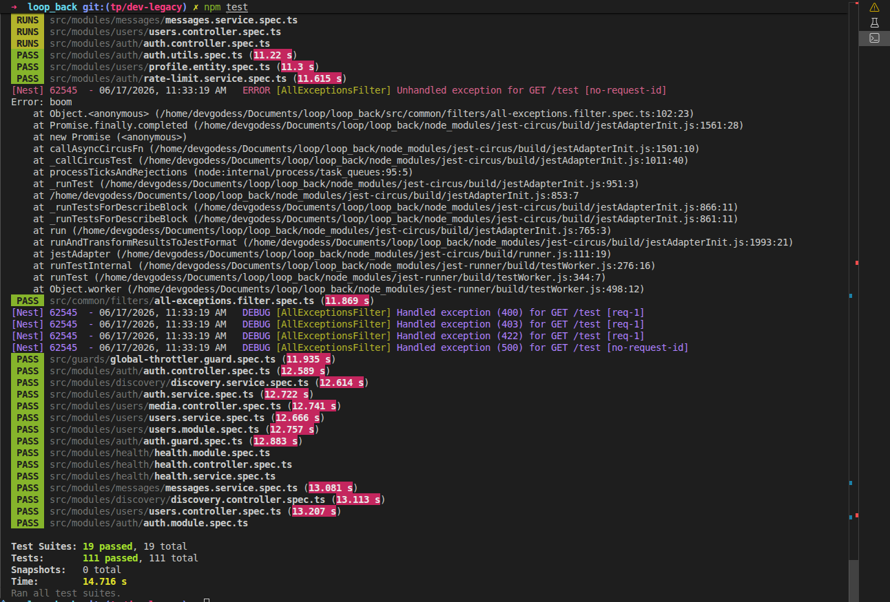

> Note : dans la capture du résumé, les lignes `ERROR … Unhandled exception / boom` sont des
> **logs volontaires** du test du filtre d'exceptions (`all-exceptions.filter.spec.ts`), pas des échecs.

### 4.6 Qui a fait quoi

Océane GLANEUX (développeuse).

---

## 5. C2 — Correctif

- **Symptôme observé** : un profil **bloqué** réapparaît dans `GET /messages/threads`
  (et redevient joignable en messages temps réel) alors que le blocage est actif.
- **Reproduction** (avant fix) :
  1. A et B se likent → match créé.
  2. A bloque B (`POST /user/blocks/:id`) → `blockUser` soft-delete le match → thread disparu ✅.
  3. B rappelle `POST /swipes { targetProfileId: A, isLike: true }` **en direct** (l'endpoint
     ne passe pas par la queue qui filtre les bloqués).
  4. Le like réciproque de A subsiste → `ensureMatch` **restaure** le match soft-deleted.
  5. A appelle `GET /messages/threads` → **le profil de B réapparaît**.
  - Reproduit par un test unitaire rouge sur `DiscoveryService.swipe` (match restauré malgré blocage).
- **Cause racine** : `swipe()` ([discovery.service.ts:174](../src/modules/discovery/discovery.service.ts#L174))
  (re)créait/restaurait un match via `ensureMatch` **sans vérifier `isBlocked`**, alors que
  `sendMessage` le faisait déjà. `blockUser` ne supprime que le match, pas les swipes `isLike` :
  un swipe direct pouvait donc reformer le match.
- **Correction** : ajout d'un garde `isBlocked` avant `ensureMatch` dans `swipe()` — aucun match
  n'est (re)formé entre profils bloqués (cohérent avec `sendMessage`).
- **Test de non-régression** : `DiscoveryService › does not (re)create a match between blocked
profiles on swipe` (passe de rouge à vert). Suite : **112/112**.

**📸 Comportement AVANT (test rouge — bug reproduit) :**

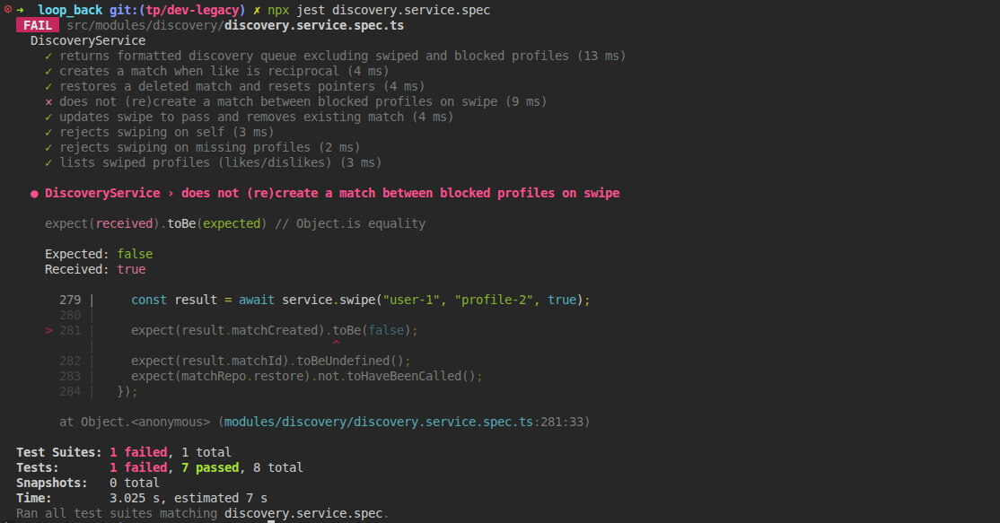

**📸 Comportement APRÈS (test vert) :**

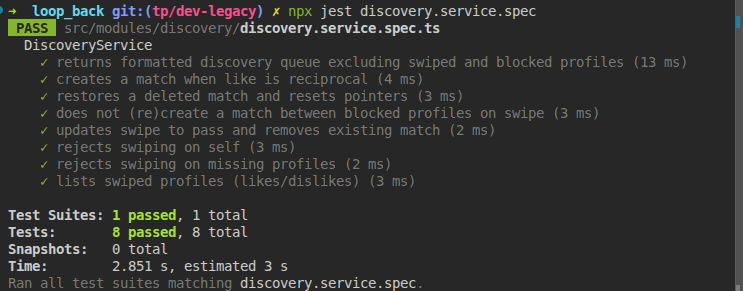

**📸 Suite discovery au vert :**


**📸 Diff du correctif :**

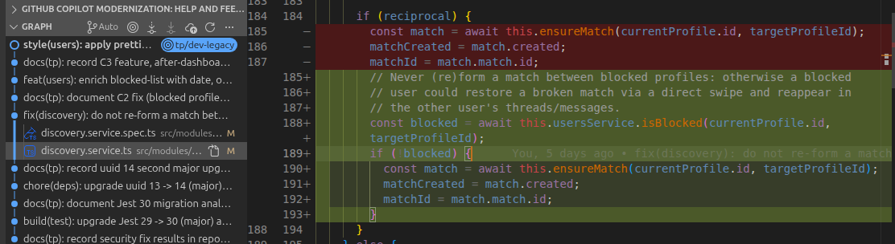

### Qui a fait quoi

Océane GLANEUX (développeuse).

---

## 6. C3 — Évolutif

- **Besoin** : l'écran « utilisateurs bloqués » ne donnait qu'une liste brute de profils —
  ni date de blocage, ni ordre, ni recherche. Peu exploitable dès qu'on a plusieurs blocages.
- **Implémentation** (`GET /user/blocks`) :
  - chaque entrée porte désormais un champ **`blocked_at`** (date du blocage) ;
  - résultats triés **du plus récemment bloqué au plus ancien** (`order: createdAt DESC`) ;
  - paramètre optionnel **`?search=`** filtrant par prénom / nom / pseudo (insensible à la casse).
  - Fichiers : `users.service.ts` (`listBlockedUsers`), `users.controller.ts` (`@Query("search")`).
- **Test** : `lists blocked profiles with a blocked_at date, most recent first` +
  `filters blocked profiles by search term (name or pseudo)`. Suite **114/114**.

**📸 La fonctionnalité (Swagger `GET /user/blocks` — `blocked_at` + `search`) :**

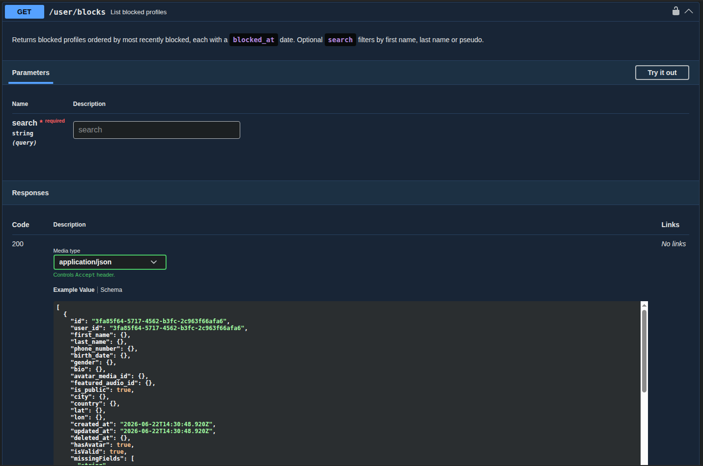

**📸 Tests de la feature au vert :**

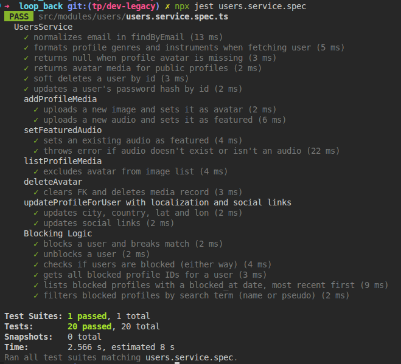

**📸 Diff de la feature :**

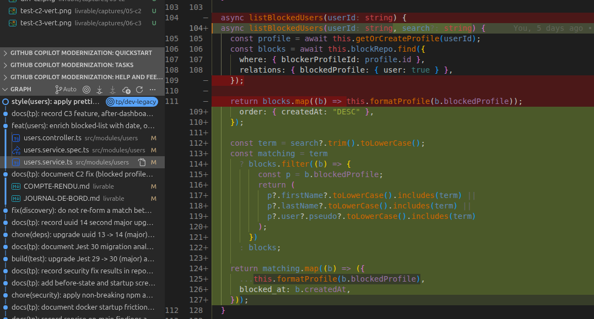

### Qui a fait quoi

Océane GLANEUX (développeuse).

---

## 7. Tableau de bord — colonne « Après » + hygiène Git

| Indicateur                   | Avant                                        | Après                                          |
| ---------------------------- | -------------------------------------------- | ---------------------------------------------- |
| Vulnérabilités (`npm audit`) | **38** (1 crit / 17 high / 17 mod / 3 low)   | **20** (modérées only)                         |
| Dépendances obsolètes        | ~32                                          | réduit (2 majeures montées : Jest 30, uuid 14) |
| Build / lint OK ?            | Build ✅ / lint ✅ (2 warnings)              | Build ✅ / `tsc --noEmit` ✅                   |
| Nb de tests                  | 111                                          | **114** (+3 : 1 régression C2, 2 feature C3)   |
| Comportement blocage         | profil bloqué pouvait réapparaître (threads) | **corrigé** (garde `isBlocked` au swipe)       |

**📸 `npm audit` (après) — 20 vulnérabilités (modérées only) :**

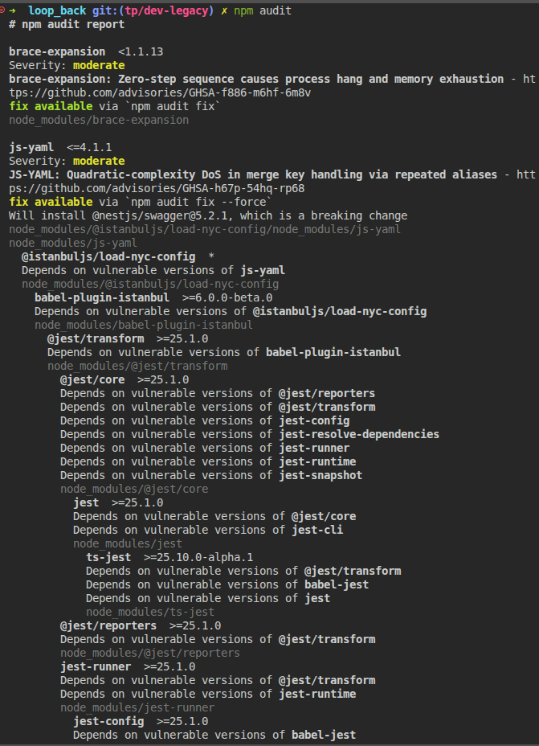
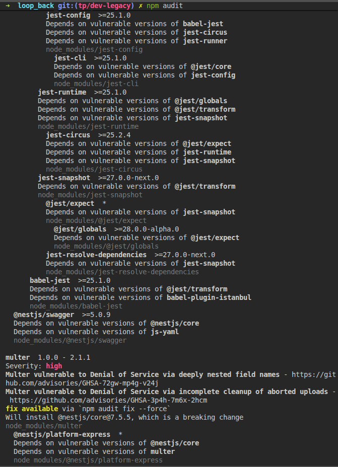
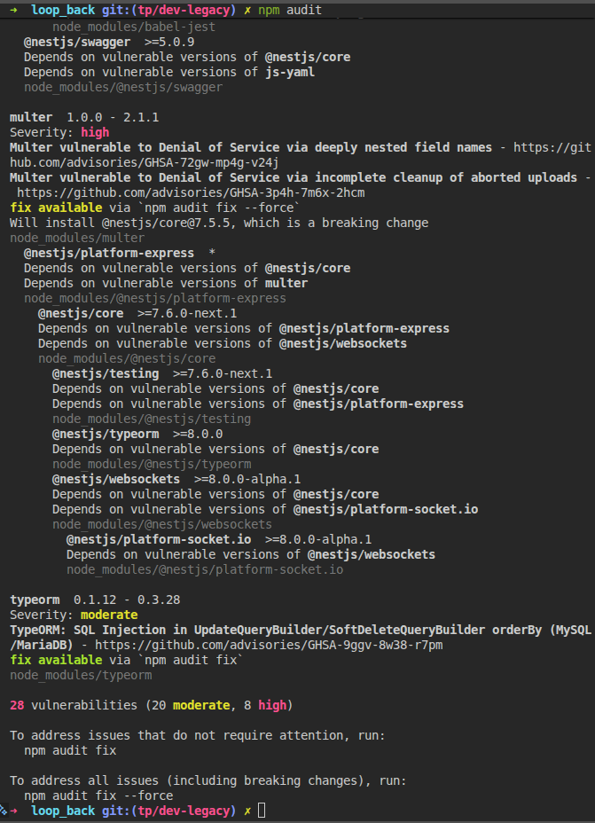

**📸 Historique Git (branche `tp/dev-legacy`, commits atomiques) :**

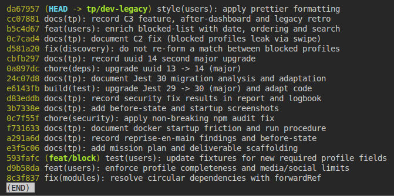

**📸 La Pull Request (#11) :**

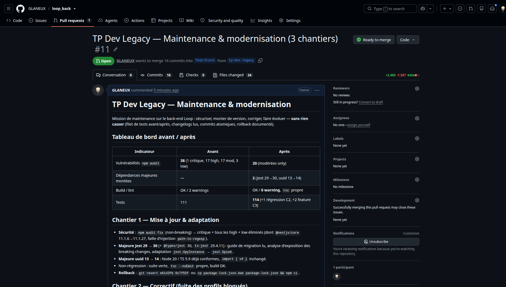
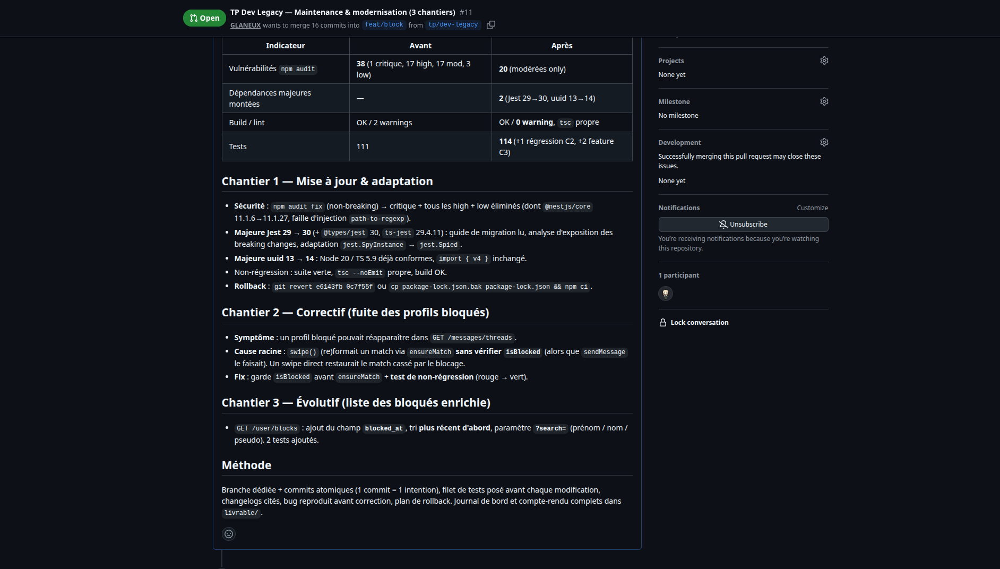

---

## 8. Bilan & rétro legacy

- **Ce que les vieilles deps / le vieux code ont coûté** :
  - 38 vulnérabilités accumulées (dont 1 critique + 17 high) faute de mises à jour régulières.
  - Une **base Docker arrêtée** + un conteneur sur réseau périmé → ~temps perdu à diagnostiquer
    un `EAI_AGAIN` qui n'était pas un bug de code.
  - Des **tests périmés** (fixtures non suivies après évolution du modèle) masquaient un filet rouge.
  - Un **résidu de config** (`.env` Prisma, coquille `tsconfig-spaths`) source de confusion.
  - Une incohérence de sécurité (blocage vérifié à l'envoi de message mais **pas au swipe**).
- **Ce qu'on changerait dans nos habitudes** :
  - **Mises à jour régulières** (Dependabot / `npm audit` en CI) plutôt qu'un gros rattrapage.
  - **Filet vert obligatoire en CI** : un test rouge ne doit jamais être mergé.
  - **Mettre à jour les tests en même temps que le modèle** (les fixtures font partie du code).
  - **Centraliser les règles transverses** (ex. un guard de blocage réutilisé) pour éviter qu'une
    nouvelle voie d'accès (swipe) oublie la règle.
  - **Documenter le démarrage** (`.env.development`, `docker compose up --force-recreate`).

---

## Annexe — Journal de bord

> Log horodaté de la journée, **y compris les impasses** (c'est valorisé).
> Format : `HHhMM — action → observation → décision`.

- `09h00` — Lecture de l'énoncé, analyse du projet (NestJS 11, 19 suites de tests).
- `09hXX` — **Nettoyage Git** : WIP block non commité rangé en 2 commits atomiques sur
  `feat/block` ; coquille `package.json` (`tsconfig-spaths`) réparée ; branche `tp/dev-legacy`
  créée depuis `feat/block`.
- `09hXX` — Backup `package-lock.json` → `package-lock.json.bak` (point de rollback).
- `09hXX` — **Friction build** : `npm run build` → 213 erreurs `TS5033 EACCES`.
  Diagnostic : `dist/` appartenait à `root:root` (conteneur Docker). → `rm -rf dist` → rebuild OK.
- `09hXX` — **Friction tests** : 3 tests rouges (fixtures profil périmées vs nouveaux champs
  obligatoires `phoneNumber`/`audio_presentation`). → fixtures mises à jour → **111/111 verts**.
- `09hXX` — État « Avant » figé : 38 vulns (`npm audit`), ~32 deps obsolètes, build ✅, 111 tests ✅.
  Captures faites : `npm audit`, `npm outdated`, `npm test`.
- `10hXX` — **Friction Docker** : `loop_db_dev` arrêté depuis 2 mois → API en `EAI_AGAIN db`.
  `restart` insuffisant (réseau périmé) → `docker compose up -d --force-recreate` →
  API up sur :3001 ("🚀 API running on port 3001"). Capture `projet-demarre` faite.

### C1 — Sécurité

- `11hXX` — `npm audit fix --dry-run` pour comprendre l'impact (116 paquets, non-breaking).
- `11hXX` — `npm audit fix` appliqué → **38 → 21 vulns** (critique + 17 high + 3 low éliminés).
  Seul `package-lock.json` modifié. `npm test` → **111/111**. `npm run build` → OK. Commit atomique.

### C1 — Majeure Jest 29 → 30

- `11hXX` — Lecture du guide officiel (upgrading-to-jest30) AVANT upgrade. `grep` des patterns
  cassants : 0 matcher déprécié, 1 seul `jest.SpyInstance` (health.service.spec.ts).
- `11hXX` — `npm i -D jest@^30 @types/jest@^30 ts-jest@latest` → jest 30.4.2, ts-jest 29.4.11.
  Bonus vulns 21 → 20.
- `11hXX` — `npm test` direct → **111/111** (ts-jest ne type-check pas au runtime).
- `11hXX` — Vérif type-check : `@types/jest` 30 garde `SpyInstance` (alias) → `tsc` propre.
  Modernisation quand même : `SpyInstance` → `jest.Spied`. tsc propre, 111/111, build OK. Commit.

### C1 — Bonus 2ᵉ majeure uuid 13 → 14

- `12hXX` — Lecture changelog uuid v14 (Node ≥20, TS ≥5.4.3 — déjà OK ; `import { v4 }` inchangé).
  Upgrade `uuid@^14`. tsc/tests/build OK + sanity runtime v4. Sans refacto (peu épineux).

### C2 — Correctif (fuite profils bloqués)

- `13hXX` — Symptôme : un profil bloqué réapparaît dans `GET /messages/threads`.
- `13hXX` — Repro (test rouge) : `swipe()` restaure un match soft-deleted malgré le blocage.
- `13hXX` — **Cause racine** : `swipe()`/`ensureMatch` ne vérifiait pas `isBlocked` (alors que
  `sendMessage` oui) ; `blockUser` ne supprime que le match, pas les swipes `isLike`.
- `14hXX` — Fix : garde `isBlocked` avant `ensureMatch`. Test rouge → vert. Suite 112/112. Commit.

### C3 — Évolutif (enrichir liste des bloqués)

- `15hXX` — `GET /user/blocks` : ajout `blocked_at`, tri plus-récent-d'abord, `?search=` (nom/pseudo).
  Fichiers : users.service.ts, users.controller.ts (+ `@Query`). 2 tests ajoutés. Suite 114/114.

### Clôture

- `16hXX` — `npm audit` après : **20** vulns (modérées). Tableau « Après » rempli.
- `16hXX` — PR #11 ouverte, `@celianlb` ajouté en reviewer (accès lecture).
